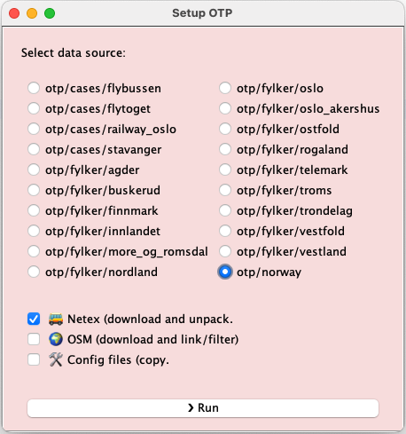

# otp-data

This project is used to setup OTP data. It downloads OSM and NeTEx files, filter them and
copy the otp config files into the setup.

The config files should be maintained and kept up to date with the Entur config for the OTP
deployment.

## Setup

The main script is written in Kotlin, but a few terminal commands are executed from the 
Kotlin code. So you need `osmium` and `wget`.

1. Clone this Git repo
2. Install `osmium`. This is used to filter the OSM file using the geojson. 
3. Install `wget` or add support for `curl`. Used to download files (OSM and NeTEx). 

## Run

I added a Swing UI (yes it old) to run this instead of a cli. Add a cli if you prefer that.

1. Run `org.entur.otp.setup.Main`

   

2. Select the setup configuration you want and witch files (OSM/NeTEx/config), and push run.

> 🎯 **Note** To avoid spending time on downloading the  _norway-latest.osm.pbf_ the script check
>             the timestamp on the file and downloads it automatically if it is older than 14 days.
 

## Adding a new configuration 

1. Add a new row in the [cases.txt](cases.txt)
2. Use https://geojson.io/ to create a GEOJSON to use for filtering OSM data. Put the geojson 
   file in the `osm/geojson` directory. Give a descriptive name. If no GoeJson file is provided, 
   the setup script will generate a link to the _norway-latest.osm.pbf_ in the target directory. 
3. The `src/main/config.kt` contains the configuration for the download locations. GTFS is not 
   supported, but should be easy to add.

## Script `otp-clean`

Search and delete transit data, osm, config, graph and report files recursively in a target dir.

>
> $ ./otp-clean --help
>
